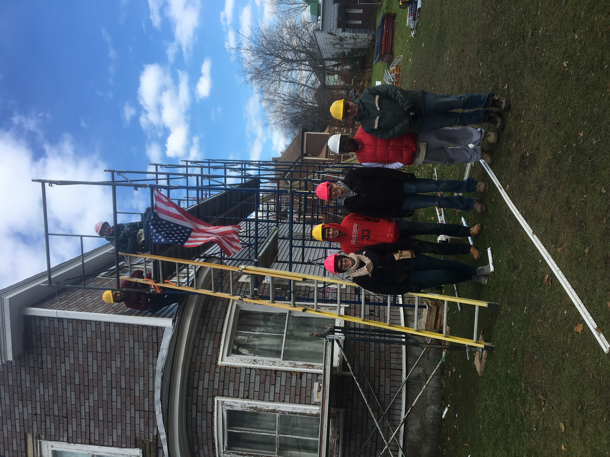
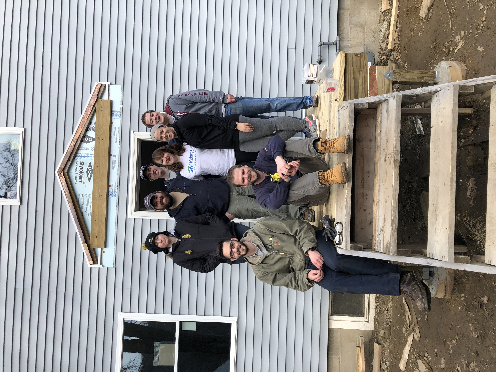
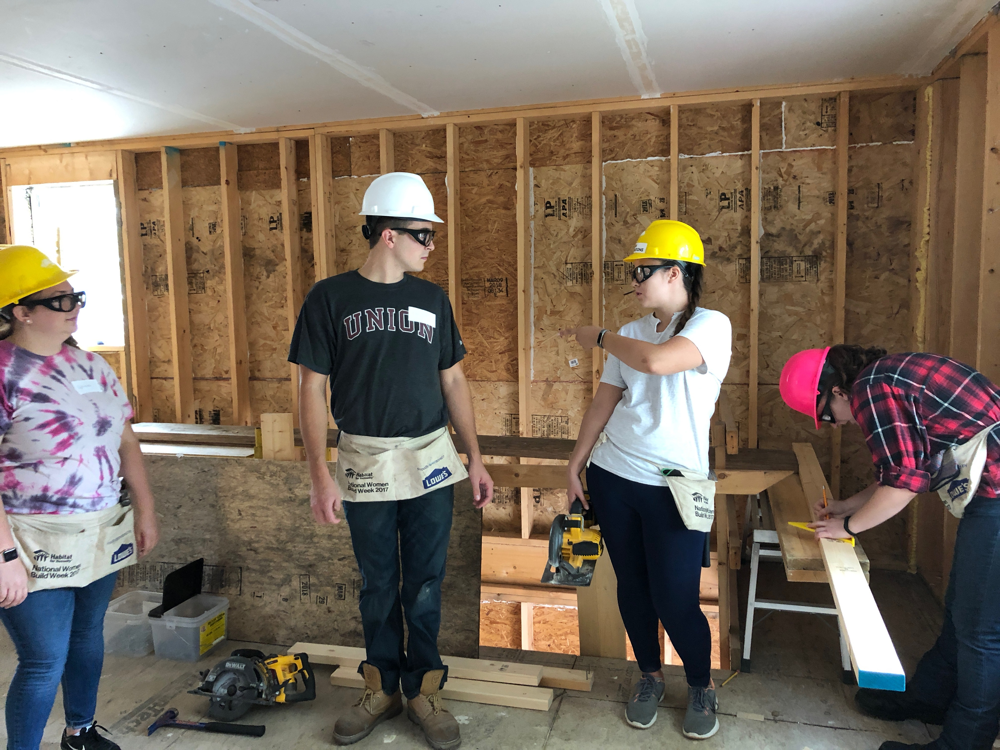
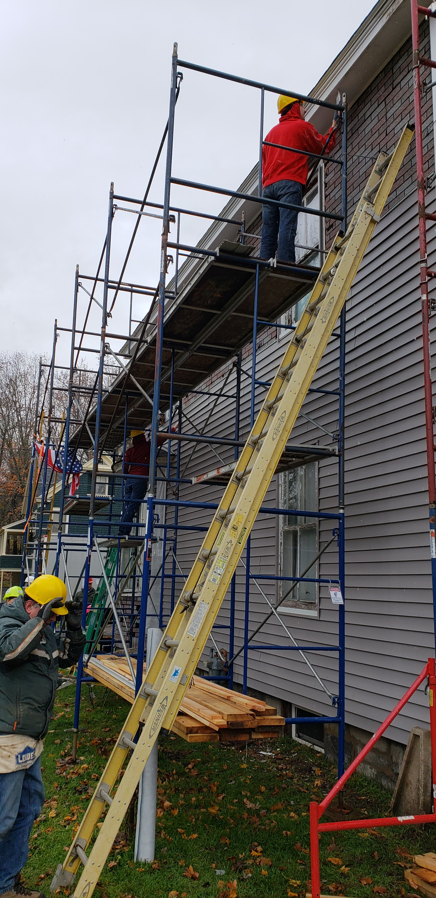
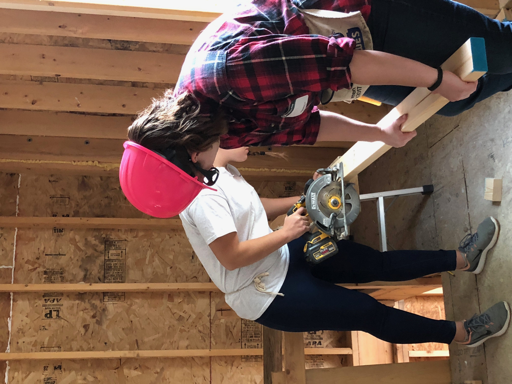

General Dynamics supports Central Berkshire Habitat for Humanity (CBHFH) in their mission to provide nonprofit housing for individuals within the community. 

General Dynamics sponsors several CBHFH builds each year. During these builds employees volunteer their time by assisting on a local construction, rehabilitation, or preservation project. Each build involves10 volunteers who work diligently beside CBHFH trained volunteers, 8:00am-3:00pm, to complete the tasks planned for that day. 

Over the past few years the General Dynamics team has been able to help on projects such as the construction of a two floor home for a single mother of two and the rehabilitation of the home of a local veteran. 

In 2019, General Dynamics is sponsoring 5 builds, including the Women’s Build.

