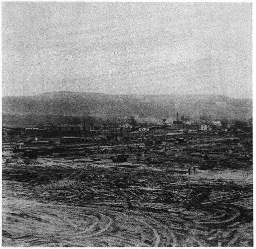
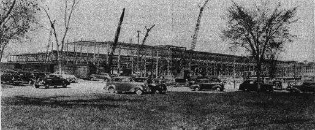
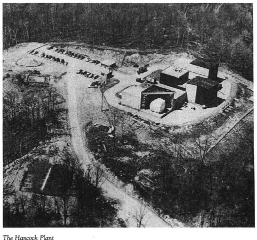
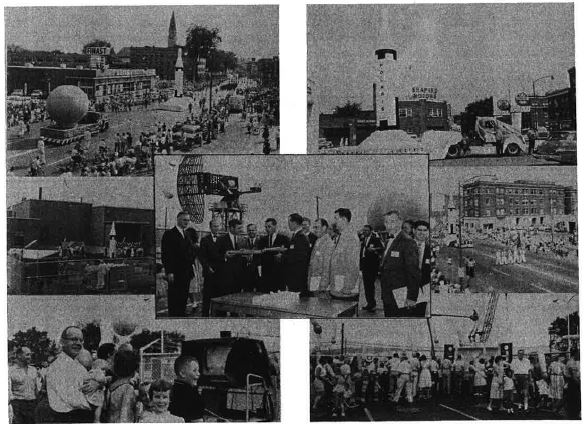

### Construction of Ordinance Plants Begin
Excavation begins on Ordinance Place 1 and 2 on November 29th, 1940. The $1-million building was to become the first of three Ordinance Plants owned by the Navy and operated by General Electric. The three buildings were built specifically for the manufacture of gun directors for an expanding Navy Fleet during World War II. 

### Construction of East Plant
By January 1941 the East Plant neared construction and by June 1941 the first employees were beginning to move in. By August 18th, 1941 the first manufacturing equipment was turned on and running. By February 1942 the first Navy inspector moved onsite. The first product constructed in Pittsfield was the Mk 37 Gun Director to be used on Navy Destroyers being built for World War II.

