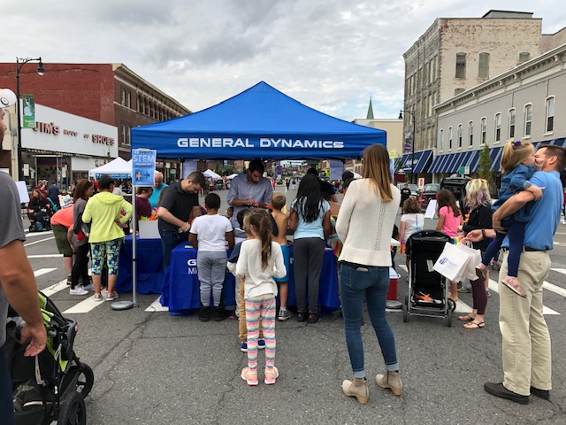
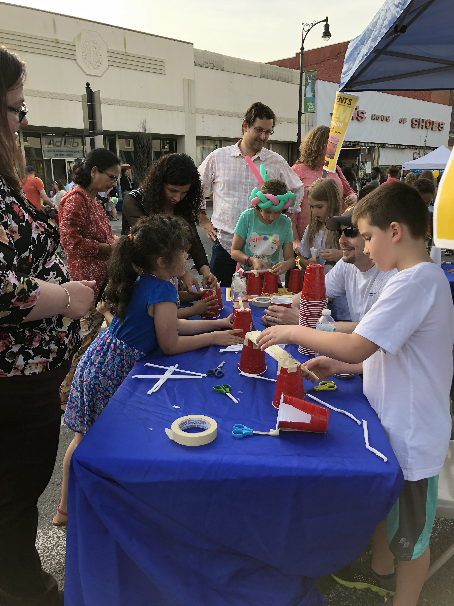
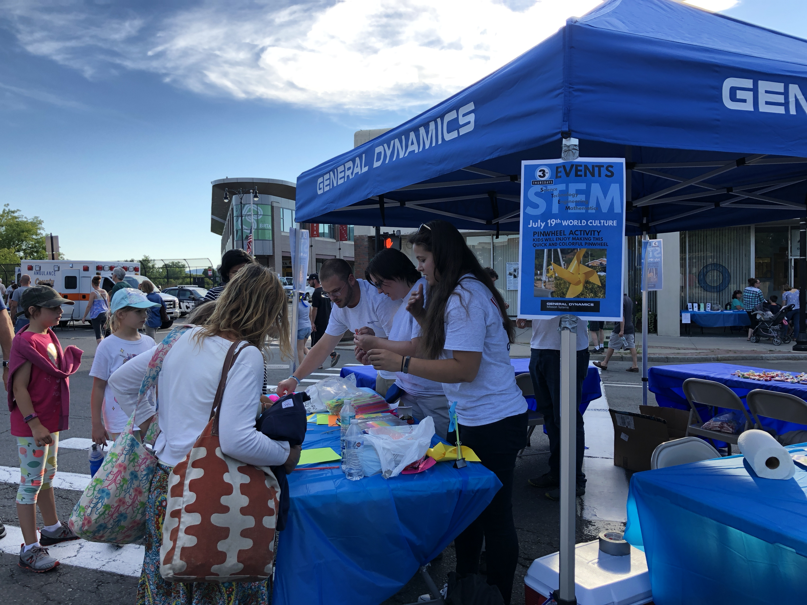
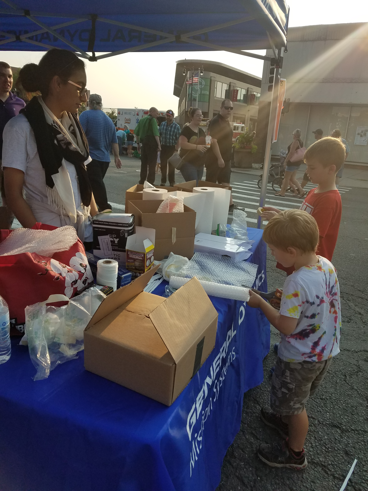

For the past 3 years, General Dynamics has sponsored and participated in Pittsfield’s 3rd Thursday celebrations. At each of these monthly events, General Dynamics volunteers run youth activities centered on Science, Technology, Engineering, Arts, and Math (STEAM) education, as well as showcase our career opportunities. Past activities have included bridge building, an egg drop competition, paper airplane construction, seed growing and pinwheel construction.

